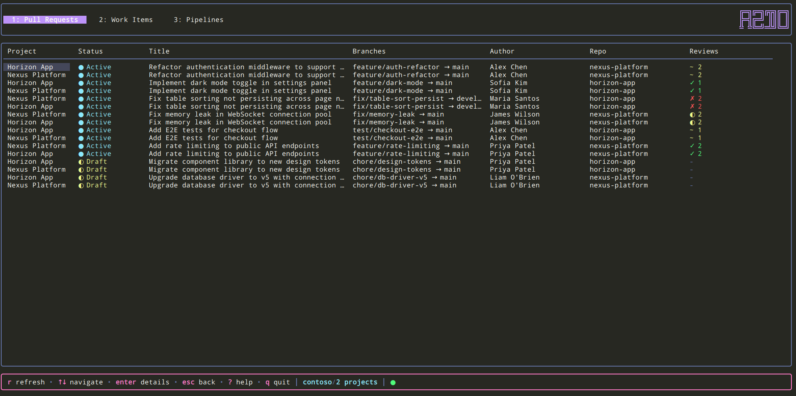

# azdo

A Terminal User Interface (TUI) for Azure DevOps - manage pull requests, work items, and pipelines directly from your terminal.


## Table of Contents

- [Installation](#installation)
- [Features](#features)
- [Demo Mode](#demo-mode)
- [CLI Usage](#cli-usage)
- [Configuration](#configuration)
- [Keyboard Shortcuts](#keyboard-shortcuts)
- [Technology Stack](#technology-stack)
- [Development](#development)
- [FAQ](#faq)
- [Contributing](#contributing)
- [License](#license)

## Installation

### Quick Install (Recommended)

**Linux / macOS:**
```bash
curl -fsSL https://raw.githubusercontent.com/Elpulgo/azdo/main/install.sh | sh
```

**Windows (PowerShell):**
```powershell
irm https://raw.githubusercontent.com/Elpulgo/azdo/main/install.ps1 | iex
```

The install scripts will automatically:
- Detect your OS and architecture
- Download the latest release from GitHub
- Install the binary to the appropriate location
- Create a config file with placeholder values
- Verify the download checksum

**Install options:**
```bash
# Install a specific version
curl -fsSL https://raw.githubusercontent.com/Elpulgo/azdo/main/install.sh | sh -s -- --version v0.1.0

# Install to a custom directory
./install.sh --install-dir ~/bin
```

### Manual Download

Download the latest release for your platform from the [Releases page](https://github.com/Elpulgo/azdo/releases).

| Platform | Architecture | File |
|----------|-------------|------|
| Linux    | x86_64      | `azdo_*_Linux_x86_64.tar.gz` |
| Linux    | ARM64       | `azdo_*_Linux_arm64.tar.gz` |
| macOS    | x86_64      | `azdo_*_Darwin_x86_64.tar.gz` |
| macOS    | ARM64 (M1+) | `azdo_*_Darwin_arm64.tar.gz` |
| Windows  | x86_64      | `azdo_*_Windows_x86_64.zip` |
| Windows  | ARM64       | `azdo_*_Windows_arm64.zip` |

Extract the archive and move the binary to a directory in your `PATH`.

### From Source

```bash
git clone https://github.com/Elpulgo/azdo.git
cd azdo
go build -o azdo-tui ./cmd/azdo-tui
```

### Using Go Install

```bash
go install github.com/Elpulgo/azdo/cmd/azdo-tui@latest
```

## Features

### Multi-Tab Interface
- **Pull Requests** (Tab 1): View and track pull requests
- **Work Items** (Tab 2): Browse and manage work items
- **Pipelines** (Tab 3): Monitor and drill into pipeline runs
- Switch between tabs using `1`, `2`, `3` keys or `←`/`→` arrow keys

### Pull Requests
- List view of pull requests with status indicators
- Filter to show only your created PRs (`m` key) or PRs where you're a reviewer (`A` key)
- Detailed view showing PR information and metadata
- Vote on PRs directly from the detail view (approve, reject, suggestions, wait, reset)
- **Code review**: Diff viewer with file-by-file navigation
- Inline commenting, thread replies, and thread resolution
- General (non-file-specific) comments

### Work Items
- List view of work items with status and type information
- Detailed view showing work item details
- View the Discussion (comments) below the description, newest first
- Add comments from the detail view (`c` key, multi-line form)
- Change work item state directly from the detail view (dynamically fetches available states)
- Filter to show only your assigned items
- Filter by tag (`T` key)
- Filter by state (`s` key)

### Pipeline Dashboard
- View recent pipeline runs in a sortable table
- Color-coded status indicators (✓ Success, ✗ Failed, ● Running, ○ Queued)
- Filter by status (`S` key)
- Live auto-refresh with configurable polling interval
- Connection status indicator in footer
- Hierarchical detail view with stages, jobs, and tasks
- Duration tracking for each step
- Full log viewer with scrollable viewport

### Metrics Dashboard (opt-in)

A management view for team leads, **disabled by default**. Enable it via `metrics.enabled: true` in `config.yaml` and a fourth tab appears.

Two sub-views, toggled with `v`:

- **Live** — current-state dwell per work item, per-user roll-up (WIP, in-flight, oldest Active / Ready for Test, points closed in the configured interval), and a worst-first "stuck items" pane. Sourced from the live work-item fetch — no local state, on-demand refresh only.
- **Trends** — sprint-on-sprint comparison from a local 90-day snapshot file. Pick any combination of sprint tags with `T` (multi-select; space toggles, enter confirms) and see per-user **points closed**, **average WIP**, **stuck count**, and **cycle time** side-by-side. Values are colored: green for closed points, yellow when overloaded, red for stuck items.

The snapshot file lives at `~/.config/azdo-tui/metrics.jsonl`. One row per work item per day is appended on first metrics-tab launch each day, then pruned to a 90-day window. No database — append-only JSONL.

**One-shot backfill (optional).** A fresh install starts with an empty snapshot file, so the Trends view shows "Insufficient snapshot history" for the first ~2 sprints. To seed the file from your team's actual recent history, set:

```yaml
metrics:
  run_one_shot_backfill: true
```

On the next launch the tab walks every in-flight or recently-closed work item across all configured projects, reads each item's revision history via `/updates`, and synthesizes daily snapshot rows back 90 days. The footer reports progress and the result. A marker file (`~/.config/azdo-tui/.metrics-backfill-done`) prevents re-running — delete it if you want to re-seed. Flip the flag back to `false` once it's done so the footer hint stops appearing.

### User Experience
- **Setup wizard** on first run guides you through configuration
- Help modal with all keyboard shortcuts (press `?`)
- Secure PAT storage using system keyring
- Context-aware keybinding hints
- Graceful error handling with automatic retry
- Eight built-in themes with true color support
- **Theme switcher** modal (press `t`) to change themes on the fly
- **Multi-project support** with display name customization
- **State persistence** — remembers the last active tab and the last opened PR / work item detail across sessions, so you can pick up where you left off

## Demo Mode

Want to try azdo without an Azure DevOps account? Run the demo — no configuration, no PAT, no setup required:

```bash
azdo demo
```

This launches the full TUI with realistic mock data (two fictional projects, pull requests with diffs, work items, pipeline runs with logs). All features work — you can navigate, view details, switch themes, and explore the UI. Perfect for evaluating the tool or taking screenshots.



See more screenshots in the [screenshots](screenshots/) folder.

## CLI Usage

```bash
# Start the TUI
azdo

# Try it out with mock data (no setup needed)
azdo demo

# Set or update your Personal Access Token
azdo auth

# Show version
azdo --version

# Show help
azdo --help
```

## Configuration

### 1. Create Configuration File

When running azdo for the first time, a **wizard setup** will help you setup this.
Otherwise follow these instructions.

Create a configuration file at the following location:
- **Linux/macOS**: `~/.config/azdo-tui/config.yaml`
- **Windows**: `C:\Users\<username>\.config\azdo-tui\config.yaml`

```yaml
# Azure DevOps organization name (required)
organization: your-org-name

# Azure DevOps project name(s) (required)
# Simple format:
projects:
  - your-project-name

# With display names (friendly name shown in UI):
#   projects:
#     - name: ugly-api-project-name
#       display_name: My Project
#     - name: ugly-api-project-name-2
#       display_name: My Project 2

# Polling interval in seconds (optional, default: 60)
polling_interval: 60

# Theme (optional, default: dark)
# Available themes: dark, gruvbox, nord, dracula, catppuccin, github, retro, monokai
theme: dark

# Disable specific panes (optional, comma-separated)
# Valid values: pipelines, workitems
# disabled_panes: pipelines,workitems

# Metrics dashboard (opt-in, management feature). Hidden unless enabled.
# See "Metrics Configuration" below for the full reference.
# metrics:
#   enabled: false
#   interval_days: 14            # window for the Live "closed pts" column
#   active_stale_days: 3         # dwell in Active above this flags the item
#   rft_stale_days: 2            # dwell in Ready for Test above this flags the item
#   wip_limit: 4                 # in-flight strictly above this marks a user overloaded
#   run_one_shot_backfill: false # one-time /updates seed (see Features → Metrics)
#   states:                      # your board's actual state names (case-insensitive)
#     active: Active
#     ready_for_test: Ready for Test
#     closed: Closed
#   state_labels:                # optional column-header overrides (auto-derived if omitted)
#     active: active
#     ready_for_test: rft
#     closed: closed
```

**Configuration Options:**
- `organization`: Your Azure DevOps organization name (required)
- `projects`: List of Azure DevOps project names (required). Each entry can be a plain string or an object with `name` and `display_name` fields. The `display_name` is shown in the TUI while the `name` is used for API calls.
- `polling_interval`: How often to refresh data in seconds (optional, default: 60)
- `theme`: Color theme for the UI (optional, default: dark)
- `disabled_panes`: Comma-separated list of panes to hide (optional). Valid values: `pipelines`, `workitems`. When a pane is disabled, its tab, keyboard shortcuts, and all related UI are removed. Pull Requests cannot be disabled.
- `metrics`: Opt-in management dashboard. See [Metrics Configuration](#metrics-configuration) below for the full reference, and [Features → Metrics Dashboard](#metrics-dashboard-opt-in) for what it does.

**Available Themes:**
- `dark` - Dark theme with blue and cyan accents
- `gruvbox` - Retro groove color scheme
- `nord` - Arctic, north-bluish color palette
- `dracula` - Default dark theme with purple and pink accents
- `catppuccin` - Soothing pastel theme (Mocha variant)
- `github` - GitHub Dark theme
- `retro` - Matrix-inspired green phosphor on black
- `monokai` - Classic Monokai color scheme

### Metrics Configuration

The metrics dashboard is **opt-in and hidden entirely** unless `metrics.enabled: true`. All keys live under the top-level `metrics:` block and are optional — the defaults below apply when a key is omitted. The validation rules only apply when `enabled` is `true`.

| Key | Type | Default | Description |
|---|---|---|---|
| `metrics.enabled` | bool | `false` | Master switch. The whole tab is hidden when `false`. |
| `metrics.interval_days` | int | `14` | Look-back window (days) for points-closed / velocity. Must be `> 0`. |
| `metrics.active_stale_days` | int | `3` | Dwell in Active longer than this flags the item as stuck. Must be `>= 0`. |
| `metrics.rft_stale_days` | int | `2` | Dwell in Ready-for-Test longer than this flags the item as stuck. Must be `>= 0`. |
| `metrics.wip_limit` | int | `4` | In-flight items *strictly above* this marks a user overloaded (⚠). Must be `> 0`. |
| `metrics.run_one_shot_backfill` | bool | `false` | One-time 90-day `/updates` seed of history on next launch. A marker file prevents it re-running. |

#### State names — `metrics.states`

These map your board's **actual workflow-state strings** onto the three buckets the metrics engine tracks. Matching is **case-insensitive and whitespace-trimmed**, but each takes a **single name** (no comma-separated aliases). If your board doesn't literally use "Active" / "Ready for Test" / "Closed", set these or the metrics tab will bucket nothing.

| Key | Default |
|---|---|
| `metrics.states.active` | `Active` |
| `metrics.states.ready_for_test` | `Ready for Test` |
| `metrics.states.closed` | `Closed` |

Each name must be non-empty, **distinct** from the other two, and contain no single quote (`'`) — single quotes are rejected for WIQL-injection safety.

#### Column labels — `metrics.state_labels` (optional)

Display-only overrides for the metrics table column headers. When omitted, labels are **auto-derived** from the configured state name: multi-word names become lowercased initials (`Ready for Test` → `rft`, `In Progress` → `ip`), single-word names are lowercased as-is (`Done` → `done`).

| Key | Falls back to |
|---|---|
| `metrics.state_labels.active` | derived from `states.active` |
| `metrics.state_labels.ready_for_test` | derived from `states.ready_for_test` |
| `metrics.state_labels.closed` | derived from `states.closed` |

**Example — a board using "Doing" / "QA" / "Done":**

```yaml
metrics:
  enabled: true
  interval_days: 14
  wip_limit: 4
  states:
    active: Doing
    ready_for_test: QA
    closed: Done
  state_labels:
    ready_for_test: QA   # override the auto-derived lowercase "qa" to keep the caps
```

### Custom Themes

You can create your own custom themes by placing JSON theme files in the themes directory:
- **Linux/macOS**: `~/.config/azdo-tui/themes/`
- **Windows**: `C:\Users\<username>\.config\azdo-tui\themes\`

**Creating a Custom Theme:**

1. Create the themes directory if it doesn't exist:
   ```bash
   mkdir -p ~/.config/azdo-tui/themes
   ```

2. Create a JSON theme file (e.g., `mytheme.json`):
   ```json
   {
     "name": "mytheme",
     "primary": "#0088ff",
     "secondary": "#00aaff",
     "accent": "#ff8800",
     "success": "#00ff88",
     "warning": "#ffaa00",
     "error": "#ff4444",
     "info": "#00ccff",
     "background": "#1a1b26",
     "background_alt": "#24283b",
     "background_select": "#343b58",
     "foreground": "#c0caf5",
     "foreground_muted": "#787c99",
     "foreground_bold": "#ffffff",
     "select_foreground": "#ffffff",
     "select_background": "#0088ff",
     "border": "#3b4261",
     "link": "#7aa2f7",
     "spinner": "#bb9af7",
     "tab_active_foreground": "#ffffff",
     "tab_active_background": "#0088ff",
     "tab_inactive_foreground": "#787c99"
   }
   ```

3. Set the theme in your `config.yaml`:
   ```yaml
   theme: mytheme
   ```

4. Restart the application to use your custom theme.

See `example-theme.json` in the repository for a complete template with all available color properties. Colors can be specified as:
- Hex values: `#ff0000` or `#f00`
- ANSI 256 colors: `"1"`, `"33"`, `"196"`

### State File

The application persists a small amount of navigation state between runs (last active tab, last opened PR / work item detail) so you land back where you left off. The file is written to:

- **Linux/macOS**: `$XDG_STATE_HOME/azdo-tui/state.yaml` if set, otherwise `~/.local/state/azdo-tui/state.yaml`
- **Windows**: `%USERPROFILE%\.local\state\azdo-tui\state.yaml`

The file is created lazily — no state file is required to run the app. Writes are debounced and flushed on clean exit (including SIGINT / SIGTERM / SIGHUP). Delete the file to reset the saved view.

### 2. Azure DevOps Personal Access Token (PAT)

On first run, the application will prompt you to enter your Azure DevOps PAT. The token is securely stored in your system's credential manager:
- **Windows**: Windows Credential Manager
- **macOS**: Keychain
- **Linux**: Secret Service (gnome-keyring, KWallet, etc.)

You can also set the `AZDO_PAT` environment variable as a fallback if your system doesn't support a keyring. To update your PAT at any time, run `azdo auth`.

**Required PAT Scopes:**
| Scope | Access | Used For |
|-------|--------|----------|
| **Build** | Read | Pipeline runs, build timelines, and logs |
| **Code** | Read & Write | List PRs, view threads/iterations/diffs, vote on PRs, add comments, and update thread status |
| **Work Items** | Read & Write | Query and view work items, read/add comments, fetch available states, and change work item state |

To create a PAT:
1. Go to Azure DevOps → User Settings → Personal Access Tokens
2. Click "New Token"
3. Select the required scopes
4. Copy the generated token

## Keyboard Shortcuts

### Global
| Key | Action |
|-----|--------|
| `1`, `2`, `3` | Switch to PR/Work Items/Pipelines tab |
| `←/→` | Previous / next tab |
| `r` | Refresh data |
| `↑/↓` or `j/k` | Navigate up/down |
| `pgup/pgdn` | Page up/down |
| `enter` | View details / expand |
| `f` | Search / filter |
| `m` | Toggle my items (PRs / work items) |
| `A` | Toggle as reviewer (PRs) |
| `T` | Filter by tag (work items) |
| `s` | Filter by state (work items) |
| `S` | Filter by status (pipelines) |
| `esc` | Go back / dismiss search |
| `?` | Toggle help modal |
| `t` | Select theme |
| `q` or `Ctrl+C` | Quit |

### PR Detail View
| Key | Action |
|-----|--------|
| `v` | Vote on pull request |
| `o` | Open pull request in browser |
| `enter` | View diff for selected file |

### PR Diff / Code Review View
| Key | Action |
|-----|--------|
| `c` | Create comment (on selected line or general) |
| `p` | Reply to nearest thread |
| `x` | Resolve nearest thread |
| `n` | Jump to next comment |
| `N` | Jump to previous comment |
| `r` | Refresh changed files |

### Work Item Detail View
| Key | Action |
|-----|--------|
| `w` | Change work item state |
| `c` | Add a comment (opens form; `Ctrl+S` to send, `Esc` to cancel) |
| `o` | Open work item in browser |

### Log Viewer
| Key | Action |
|-----|--------|
| `g` | Jump to top |
| `G` | Jump to bottom |

## Technology Stack

- **Go 1.23+**
- [Bubble Tea](https://github.com/charmbracelet/bubbletea) - Terminal UI framework
- [Bubbles](https://github.com/charmbracelet/bubbles) - TUI components (table, viewport)
- [Lipgloss](https://github.com/charmbracelet/lipgloss) - Styling and layout
- [Viper](https://github.com/spf13/viper) - Configuration management
- [go-keyring](https://github.com/zalando/go-keyring) - Secure credential storage

## Development

### Running Tests

```bash
go test ./...
```

### Running with Coverage

```bash
go test -cover ./...
```

### Building

```bash
go build -o azdo ./cmd/azdo-tui
```

### Releases

See [RELEASES.md](RELEASES.md) for release process and GoReleaser usage.

## FAQ

See [FAQ.md](FAQ.md) for common questions and troubleshooting.

## Contributing

Contributions are welcome! See [CONTRIBUTING.md](CONTRIBUTING.md) for guidelines.

## License

MIT License - see [LICENSE](LICENSE) for details.
